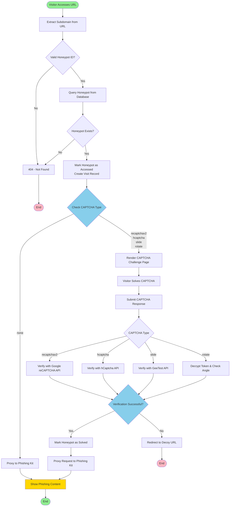

# Cloaken

Cloaken is a CAPTCHA-based hardening framework that can automatically cloak phishing kits with CAPTCHAs and serve them through randomly generated URLs.

Cloaken is developed as part of the paper: _"PhishDecloaker: Detecting CAPTCHA-cloaked Phishing Websites via Hybrid
Vision-based Interactive Models"_ to study the ability of state-of-the-art phishing detectors in detecting CAPTCHA-cloaked phishing, published at [USENIX Security '24](https://www.usenix.org/conference/usenixsecurity24/).

## Technical Details

Cloaken operates as a reverse proxy that presents visitors with a CAPTCHA challenge from a selection of templates, such as hCaptcha or reCAPTCHA v2. Once the visitor solves the CAPTCHA, the system validates the submitted challenge and subsequently reveals the phishing content. Cloaken comprises 3 components: 
1. An Nginx proxy server
2. A Node.js-based CAPTCHA server
3. A PHP server hosting the phishing kits.

## Activity Flow

The following diagram illustrates the complete activity flow of the Cloaken system:



### Flow Description

1. **Initial Request**: A visitor accesses a URL with a subdomain that serves as the honeypot ID
2. **Validation**: The system extracts the subdomain and validates if it's a valid MongoDB ObjectId
3. **Database Query**: If valid, queries the database for the corresponding honeypot entry
4. **Access Tracking**: Marks the honeypot as accessed and creates a visit record for analytics
5. **CAPTCHA Decision**: Based on the honeypot's `captchaType`:
   - **none**: Directly proxies to the phishing kit (no CAPTCHA protection)
   - **recaptchav2**: Shows Google reCAPTCHA v2 challenge
   - **hcaptcha**: Shows hCaptcha challenge
   - **slide**: Shows GeeTest slide CAPTCHA challenge
   - **rotate**: Shows custom rotation CAPTCHA challenge
6. **CAPTCHA Verification**: 
   - For third-party CAPTCHAs (reCAPTCHA, hCaptcha, GeeTest), the system makes API calls to verify the response
   - For the custom rotate CAPTCHA, the system decrypts the challenge token and validates the rotation angle
7. **Success Path**: If verification succeeds, the system marks the honeypot as solved and proxies the request to the phishing kit
8. **Failure Path**: If verification fails, the visitor is redirected to a random decoy URL from a predefined list

### Additional Features

- **Fingerprinting**: For visitors with JavaScript enabled, the system collects browser fingerprints via a beacon endpoint
- **Resource Proxying**: All phishing kit resources (CSS, JS, images) are proxied through the Cloaken server to maintain cloaking
- **Dashboard Management**: Administrators can create, manage, and export honeypot data through an authenticated dashboard

## Installation

Cloaken is tested on UNIX systems running Docker. Follow these steps to deploy the system:

1. **Clone this repository:**

    ```bash
    git clone https://github.com/code-philia/phishdecloaker
    cd phishdecloaker/cloaken
    ```

2. **Prepare phishing kits**

    Download the phishing kits used in the empirical study (see `./datasets`) or use your own, and place them in `./phishing_kits/src`.

2. **Prepare container images**

    There are two options available to prepare container images for Cloaken:

    ***Option A:** Pulling (fastest)*

    Use the following command to pull the necessary Docker images:
    ```bash
    docker compose pull phishing_kits cloaking nginx
    ```

    ***Option B:** Building (for development)*

    Use the following commands to build the Docker images yourself, for instance after you modified the code:
    ```bash
    docker compose build phishing_kits cloaking nginx
    ```

## Usage

1. **Configure environment variables**

    Create a `.env` file from `.env.example` (in the `./cloaking` folder) and fill in the missing values.

    ```python
    # 1. Dashboard
    # 1.1. Username to access dashboard
    # 1.2. Password to access dashboard
    # 1.3. port used by cloaking dashboard, can be left as-is
    DASHBOARD_USERNAME="admin"
    DASHBOARD_PASSWORD="admin"
    PORT=3000

    # 2. Generated URLs
    # 2.1. MongoDB database URI to track and manage generated URLs
    # 2.2. protocol (http/https) of generated URLs
    # 2.3. base URL pointing to container hosting phishing kits, can be left as-is
    MONGODB_URI="mongodb+srv://[username:password@]host[/[defaultauthdb][?options]]"
    PROTOCOL="http"
    PHISHING_KIT_URL="http://phishing_kits"

    # 4. For no cloaking
    # 4.1. Domain used to generate URLs with no cloaking
    NONE_DOMAIN="cloaken.com"          

    # 5. For reCAPTCHAv2 cloaking
    # 5.1. Domain used to generate URLS cloaked with reCAPTCHAv2
    # 5.2. reCAPTCHAv2 site key (see: https://developers.google.com/recaptcha/intro)
    # 5.3. reCAPTCHAv2 secret key
    RECAPTCHAV2_DOMAIN="cloaken.com" 
    RECAPTCHAV2_SITE_KEY="6LeIxAcTAAAAAJc******h71UMIEGNQ_MXjiZKhI"
    RECAPTCHAV2_SECRET_KEY="6LeIxAcTAAAAA******1TnRWxMZNFuojJ4WifJWe"

    # 6. For hCaptcha cloaking
    # 6.1. Domain used to generate URLS cloaked with hCaptcha
    # 6.2. hCaptcha site key (see: https://docs.hcaptcha.com/)
    HCAPTCHA_DOMAIN="cloaken.com
    HCAPTCHA_SITE_KEY="10000000-ffff-******fff-000000000001"
    HCAPTCHA_SECRET_KEY="0x000000000000******0000000000000000000000"

    # 7. For GeeTest slide cloaking
    # 7.1 Domain used to generated URLs cloaked with GeeTest slide CAPTCHA
    # 7.2 GeeTest captcha ID (see: https://docs.geetest.com/captcha/overview/guide)
    # 7.3 GeeTest captcha Key
    SLIDE_DOMAIN="cloaken.com"
    SLIDE_SITE_KEY="07df3141a35**********19a473d7c50"
    SLIDE_SECRET_KEY="543b19036ef********8e07d121b81e9"

    # 8. For rotate CAPTCHA cloaking
    # 8.1 Domain used to generate URLs cloaked with rotation CAPTCHA
    # 8.2 Secret key, must be a 64-character long hexadecimal string
    ROTATE_DOMAIN="cloaken.com"
    ROTATE_SECRET_KEY="52dcb71944d86b9e5046329..........72ff8f58acf50acac2ef7f18ee474ab"
    ```

2. **Configure docker compose**

    In `./docker-compose.yaml`, modify `env_file` to point to your `.env` file created in the previous step.
    ```yaml
    env_file: ./cloaking/.env
    ```

3. **Start Cloaken**

    Start all containers. The management dashboard can be accessed at the specified `PORT` by providing `DASHBOARD_USERNAME` and `DASHBOARD_PASSWORD`.
    ```bash
    docker compose up
    ```